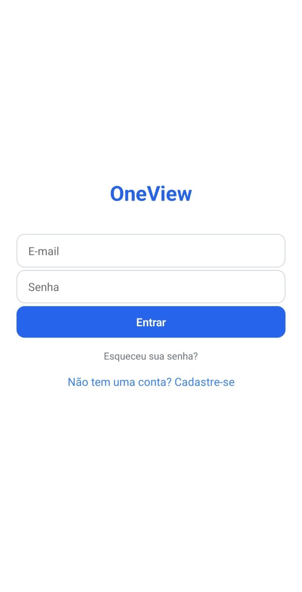
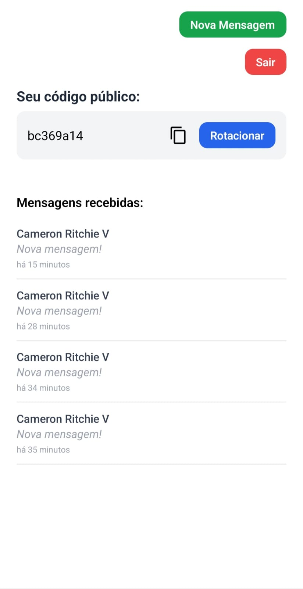
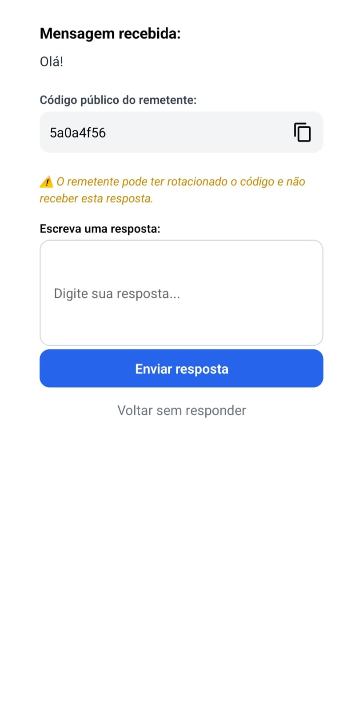
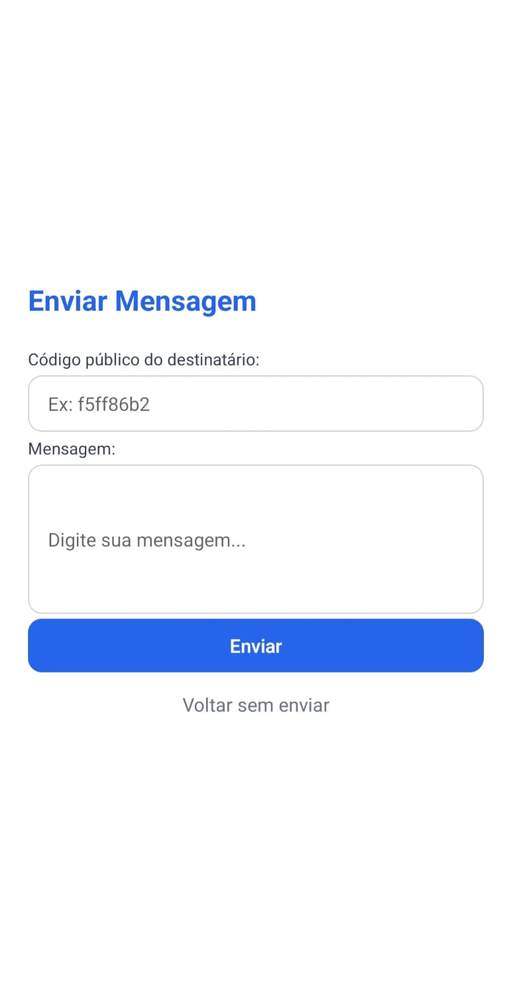
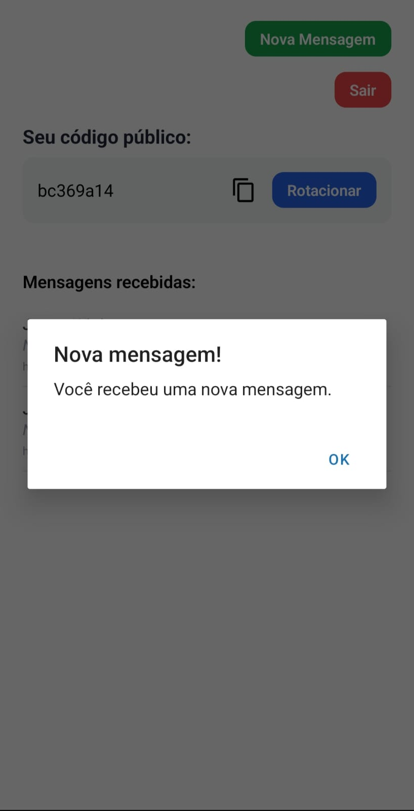
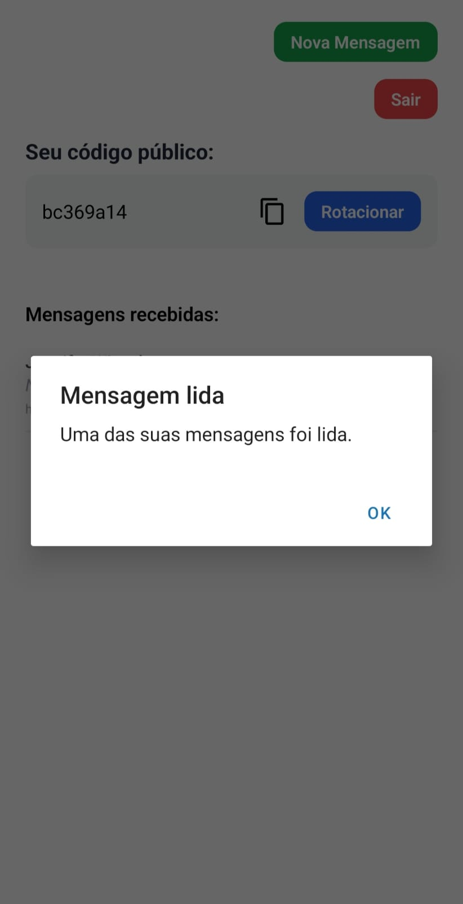

# 📱 OneView

**OneView** é um aplicativo de mensagens privadas onde os usuários trocam mensagens através de um código público rotativo. As mensagens só podem ser lidas uma vez e desaparecem após a leitura.

---

## 📸 Imagens e Demonstrações

Abaixo estão algumas capturas de tela e demonstrações do OneView em uso:

### 🔐 Tela de Login


### 📨 Mensagens Recebidas


### 👁️ Visualização de Mensagem


### ✍️ Envio de Mensagem


### 📬 Notificação em tempo real (WebSocket)



---

## 🚀 Funcionalidades

- 🔐 Login e cadastro com e-mail e senha
- 📬 Mensagens de visualização única
- 🆔 Código público rotativo para recebimento
- 📨 Envio de mensagens via código
- 👁️ Mensagens lidas são automaticamente excluídas
- 🔁 Pull to refresh
- 🔔 Notificações em tempo real com WebSocket
- 📋 Copiar código público com 1 clique

---

## 🛠️ Tecnologias

- **Frontend:** React Native + Expo
- **Estilização:** NativeWind (Tailwind para RN)
- **Validação de formulário:** react-hook-form + yup
- **Backend:** Go [Ver aqui](http://github.com/willy-r/oneview-be)

---

## ⚙️ Configuração do ambiente

### 1. Instalar dependências

```bash
npm install
pnpm i
yarn i
```

### 2. Criar arquivo `.env`

```bash
cp .env.example .env
```

### 3. Rodar a aplicação

```bash
npm run start:tunnel # ou
npm run start

yarn start:tunnel # ou
yarn start

pnpm start:tunnel # ou
pnpm start
```

---

## 📦 Estrutura

```
src/
├── components/         # Componentes reutilizáveis
├── screens/            # Telas (Login, Register, Dashboard, etc.)
├── context/            # AuthContext
├── hooks/              # useWebSocket, etc.
├── services/           # api.js (axios instance)
```

---

## 📃 Licença

Este projeto está licenciado sob a [MIT License](LICENSE).

---

## 🙌 Contribuições

Sinta-se livre para abrir PRs ou issues. Toda ajuda é bem-vinda!
